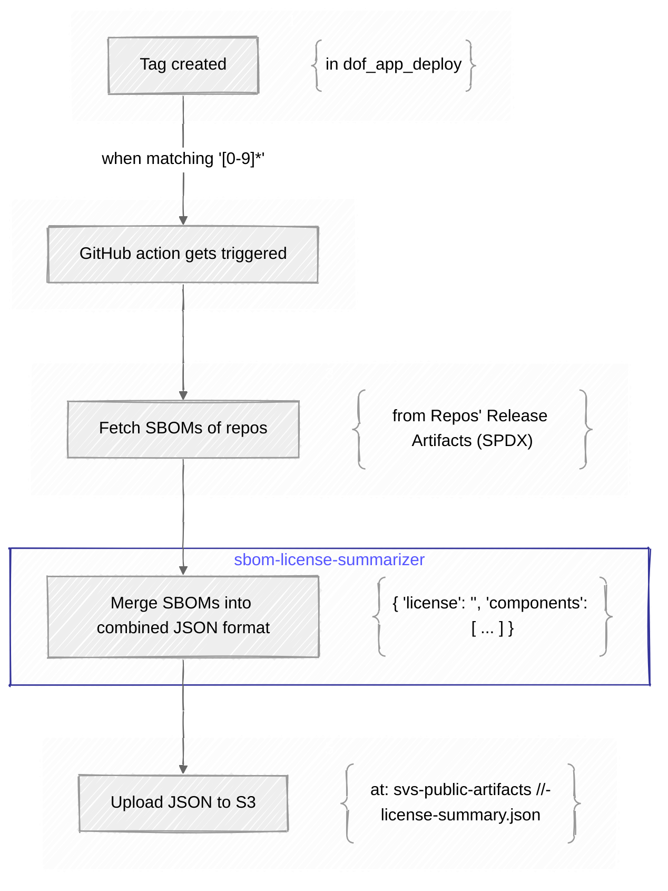

# SBOM license summarizer

SBOM license summarizer is a Github-Action that collects SBOM-files from a list of provided repositories and summarizes and groups them by license.
The resulting JSON is provided as an output variable.

## Usage

example:

```yml
steps:
    - name: Summarise SVS-SBOMs
      id: summary
      uses: hpi-schul-cloud/sbom-summarizer@v1.0.0
      with:
          filename: dependencies.sbom.json
          repos: hpi-schul-cloud/tldraw-server:33.0.0;hpi-schul-cloud/schulcloud-client:33.0.0;hpi-schul-cloud/schulcloud-server:33.0.0

    - name: work with json
      run: echo '${{ toJson(steps.summary.outputs.json) }}'
```

## Integration in SVS-deployment workflow




## Inputs

| name     | description                                                                                                                 |
| -------- | --------------------------------------------------------------------------------------------------------------------------- |
| filename | name of the json-file containing the SBOM information in SPDX format                                                        |
| repos    | list of repositories separated by semicolon - each entry in the format `{ project }/{ repo }@{ version };{ project }/s ...` |

example:

```yml
with:
    filename: dependencies.sbom.json
    repos: hpi-schul-cloud/tldraw-server:33.0.0;hpi-schul-cloud/schulcloud-client:33.0.0;hpi-schul-cloud/schulcloud-server:33.0.0
```

## Outputs

| name | description                           |
| ---- | ------------------------------------- |
| json | summarizing json - grouped by license |

example:

```jsonc
{
  "Apache License 2.0": {
    "licenseText": "Apache License\nVersion 2.0, January 2004\nhttp://www.apache.org/licenses/\n\nTERMS AND CONDITIONS FOR USE, REPRODUC...",
    "components": [
      "@ampproject/remapping@2.3.0",
      "@eslint/config-array@0.18.0",
      ...
    ]
  },
  "Blue Oak Model License 1.0.0": {
    "licenseText": "# Blue Oak Model License\n\nVersion 1.0.0\n\n## Purpose\n\nThis license gives everyone as much permission to work with\nthis software as possible, while protecting contributors\nfrom liability....",
    "components": [
      "jackspeak@3.4.3",
      "package-json-from-dist@1.0.0",
      "path-scurry@1.11.1"
    ]
  },
  "BSD 2-Clause \"Simplified\" License": {
...
```

## Maintaining

When changing the code in this action, you need to run <code>npm run build</code> afterwards and need to push not only your changes - but also the generated /dist/index.js file.

This is necessary as the action is run directly without installing any dependencies. The build script bundles the action's sourcecode and the dependencies into a single javascript file, that is directly executable.

**_Hint_**

When trying to test the changes from within another github workflow, you need to keep in mind, that you have to adapt the action call by updating/replacing the version with the current commit SHA - in order to ensure that the newest version of the action will be executed.

```yml
steps:
    - name: Summarise SVS-SBOMs
      id: summary
      uses: hpi-schul-cloud/sbom-summarizer@1.0.0
```

becomes:

```yml
steps:
    - name: Summarise SVS-SBOMs
      id: summary
      uses: hpi-schul-cloud/sbom-summarizer@878e288f16f32be59bd19b12dd668a7874df7f06
```

After finishing the implementation it makes sense to tag a new version in this repo so that other workflows can directly address it:

```yml
uses: hpi-schul-cloud/sbom-summarizer@1.0.1
```
